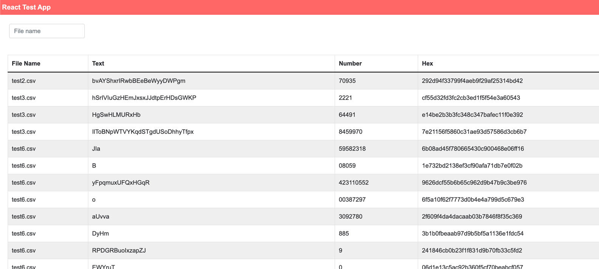
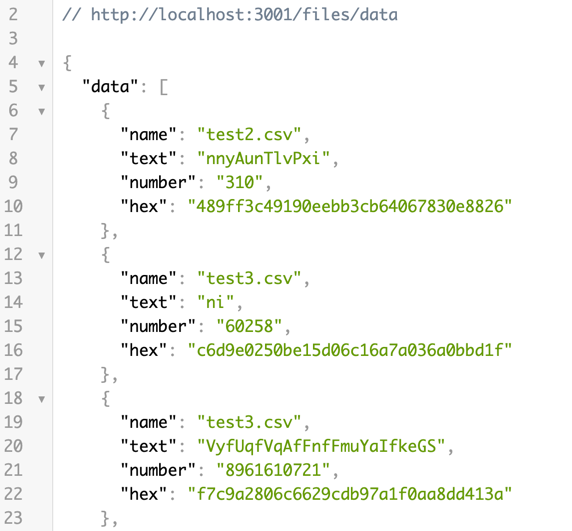

## Toolbox challenge

This is a sample project intended as a Toolbox Challenge. 

Here you will find a simple express application that will call a test endpoint and format its response so that the client can consume it. 
The client will show a table with the formatted data. The client can filter the data through a throttled input.

### How to run
1. Clone the repo
2. Install dependencies ``yarn install``
3. Run project ``yarn start``

The client will be served on the port 3000 and the server on the port 3001

### Technologies
1. Express.js
2. React.js
3. Axios

